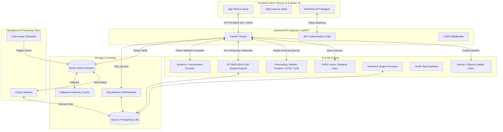

# KSP-Sentinel: AI-Powered Crime Intelligence & Predictive Analytics Platform

KSP-Sentinel is a state-of-the-art predictive policing and crime intelligence command center custom-built for the **Karnataka State Police (KSP)**. Designed to replace legacy, fragmented Excel-based reporting pipelines, KSP-Sentinel establishes a unified, secure, and data-driven platform that integrates spatiotemporal analytics, machine learning forecasts, criminal network link analysis, and socio-economic correlation engines. By doing so, it shifts the State Crime Records Bureau (SCRB) from traditional reactive tracking to proactive, evidence-based crime prevention and officer resource optimization.

---

## Table of Contents
1. [Platform Philosophy & SCRB Modernization](#1-platform-philosophy--scrb-modernization)
2. [High-Level System Architecture](#2-high-level-system-architecture)
3. [Relational Database Schema Guide](#3-relational-database-schema-guide)
4. [Analytical SQL Views](#4-analytical-sql-views)
5. [Unified Intelligence Layer](#5-unified-intelligence-layer)
6. [Key Modules & View Components](#6-key-modules--view-components)
7. [REST API Endpoint Registry](#7-rest-api-endpoint-registry)
8. [AI/ML Engine Algorithms & Mathematical Foundations](#8-aiml-engine-algorithms--mathematical-foundations)
9. [Background Task Processing (Celery & Redis)](#9-background-task-processing-celery--redis)
10. [Developer Guide & Local Setup](#10-developer-guide--local-setup)
11. [Zoho Catalyst Cloud Deployment Platform](#11-zoho-catalyst-cloud-deployment-platform)
12. [Security, Compliance & Auditing Guidelines](#12-security-compliance--auditing-guidelines)
13. [Optimization Logs & Solved Issues](#13-optimization-logs--solved-issues)

---

## 1. Platform Philosophy & SCRB Modernization

In historical police operations across Karnataka, crime reporting was bound to daily, manual entry systems. The State Crime Records Bureau compiled spreadsheets on a weekly or monthly basis. This lag prevented high-ranking officers from identifying emerging patterns in real-time.

KSP-Sentinel is designed to modernize this workflow:
- **Instant Digital Ingestion**: New FIRs are recorded directly in the central PostgreSQL/SQLite database.
- **Automated Intelligence Extraction**: Free-text complaints are processed using Sentence-Transformers to populate deduplicated database records for accused individuals, victims, locations, vehicles, and modus operandi.
- **Evidence-Based Patrol Allocation**: Rather than basing patrol beats on intuition, the platform uses spatiotemporal DBSCAN (ST-DBSCAN) clustering to direct forces to active hotspots.
- **Socio-Economic Insights**: Links census demographics directly to crime rates, enabling administrative planners to see the impact of urbanization, literacy, poverty, and unemployment on local stability.

---

## 2. High-Level System Architecture

KSP-Sentinel is built using a multi-tier decoupled microservice pattern. This ensures that resource-intensive machine learning forecasting or network graph modeling does not block critical transactional API routes.



- **Frontend Command Center**: A React 19 single-page dashboard built on Next.js 16 (using Turbopack in development). It uses Vanilla CSS, Tailwind CSS, Recharts for predictive charting, Leaflet.js for interactive mapping, and handwritten SVG elements driven by D3 layout engines for network visualizations.
- **FastAPI API Service**: A Python-based asynchronous ASGI application handling requests. It routes user authentication, CRUD operations, crime records, district statistics, and AI dispatches.
- **SQLAlchemy Database Layer**: Declares a rich relational schema. In local development, it runs against a seeded `ksp_sentinel.db` SQLite database; for production, it shifts to PostgreSQL with `pgvector` and `geoalchemy2`.
- **AI/ML Engine**: Standalone Python modules integrating Sentence-Transformers (`all-MiniLM-L6-v2`), FAISS, Scikit-learn, Statsmodels, Prophet, XGBoost, and NetworkX.
- **Background Tasks & Caching**: Powered by Celery and Redis. When Redis is unavailable locally, a custom Python caching middleware falls back transparently to an in-memory dictionary.

---

## 3. Relational Database Schema Guide

The database schema is declared in third normal form (3NF) within [backend/app/database/models.py](file:///c:/Users/jeltrin/OneDrive/Desktop/policce/KSP-Sentinel/backend/app/database/models.py). The 34 tables map to three operational domains:

```
                  ┌───────────────────────┐
                  │       districts       │
                  └───────────┬───────────┘
                              │ 1
                              │
                              │ *
                  ┌───────────▼───────────┐
                  │    police_stations    │
                  └───────────┬───────────┘
                              │ 1
                              │
                              │ *
                  ┌───────────▼───────────┐
                  │       fir_cases       │
                  └─────┬─────┬─────┬─────┘
                        │     │     │
            ┌───────────┘     │     └───────────┐
            │ *               │ *               │ *
 ┌──────────▼──────────┐ ┌────▼─────┐ ┌─────────▼─────────┐
 │       victims       │ │ accused  │ │   modus_operandi  │
 └─────────────────────┘ └──────────┘ └───────────────────┘
```

### 3.1. Core Reference Tables

1. **`districts`**: Tracks administrative boundaries. Columns:
   - `id` (Integer, PK)
   - `name` (String, unique)
   - `population` (Integer)
   - `risk_score` (Integer)
   - `risk_factors` (Text, JSON)
   - `urbanization_rate` (Float)
   - `literacy_rate` (Float)
   - `unemployment_rate` (Float)
   - `poverty_rate` (Float)
   - `geom` (Geometry, MULTIPOLYGON)
2. **`taluks`**: Sub-district boundaries. Columns:
   - `id` (Integer, PK)
   - `district_id` (Integer, FK)
   - `name` (String)
   - `geom` (Geometry, MULTIPOLYGON)
3. **`police_stations`**: Local station details. Columns:
   - `id` (Integer, PK)
   - `name` (String)
   - `district_id` (Integer, FK)
   - `taluk_id` (Integer, FK, nullable)
   - `latitude`, `longitude` (Float)
   - `geom` (Geometry, POINT)
4. **`crime_categories`**: Major classification heads. Columns:
   - `id` (Integer, PK)
   - `name` (String, unique)
   - `major_head` (String)
   - `minor_head` (String)
5. **`crime_subcategories`**: Granular classifications. Columns:
   - `id` (Integer, PK)
   - `name` (String)
   - `category_id` (Integer, FK)

### 3.2. Crime Case & Incident Tables

6. **`fir_cases`**: The central case record table. Columns:
   - `id` (Integer, PK)
   - `fir_number` (String, unique)
   - `police_station_id` (Integer, FK)
   - `subcategory_id` (Integer, FK)
   - `location_id` (Integer, FK)
   - `date_reported` (DateTime)
   - `date_occurred` (DateTime)
   - `description` (Text)
   - `status` (String: REGISTERED, INVESTIGATING, CHARGE_SHEETED, CLOSED, TRIAL)
   - `latitude`, `longitude` (Float)
   - `geom` (Geometry, POINT)
7. **`victims`**: Demographic profile of victims. Columns:
   - `id` (Integer, PK)
   - `fir_id` (Integer, FK)
   - `name` (String, nullable)
   - `age` (Integer)
   - `gender` (String)
   - `category` (String: WOMAN, CHILD, SENIOR_CITIZEN, GENERAL)
   - `injured` (Integer)
   - `dead` (Integer)
8. **`accused`**: Offender profiles. Columns:
   - `id` (Integer, PK)
   - `name` (String)
   - `age` (Integer)
   - `gender` (String)
   - `repeat_offender` (Boolean)
   - `history_sheet` (Boolean)
   - `gang` (String)
   - `prior_offenses_count` (Integer)
   - `status` (String: ACTIVE, ABSCONDING, ARRESTED, CONVICTED, INACTIVE)
9. **`fir_accused`**: Many-to-many bridge between cases and suspects. Columns:
   - `fir_id` (Integer, FK, PK)
   - `accused_id` (Integer, FK, PK)
10. **`arrests`**: Suspect booking logs. Columns:
    - `id` (Integer, PK)
    - `fir_id` (Integer, FK)
    - `accused_id` (Integer, FK)
    - `arrest_date` (DateTime)
    - `status` (String)
    - `officer` (String)
    - `court` (String)
11. **`convictions`**: Court trial records. Columns:
    - `id` (Integer, PK)
    - `fir_id` (Integer, FK)
    - `accused_id` (Integer, FK)
    - `conviction_date` (DateTime)
    - `sentence_months` (Integer)
    - `status` (String)
    - `court` (String)
    - `sentence` (String)
    - `years` (Float)
    - `fine` (Float)
12. **`investigations`**: Assignments and progress states. Columns:
    - `id` (Integer, PK)
    - `fir_id` (Integer, FK)
    - `assigned_officer` (String)
    - `status` (String: ASSIGNED, ONGOING, SUSPENDED, COMPLETED)
    - `last_updated` (DateTime)
13. **`chargesheets`**: Formal filings. Columns:
    - `id` (Integer, PK)
    - `fir_id` (Integer, FK)
    - `filed_date` (DateTime)
    - `sections` (String)
    - `status` (String)
14. **`officers`**: Duty roster records. Columns:
    - `id` (Integer, PK)
    - `name` (String)
    - `badge_number` (String, unique)
    - `rank` (String)
    - `station_id` (Integer, FK)
    - `status` (String)

### 3.3. Security & Ingestion Monitoring

15. **`users`**: Console access accounts. Columns:
    - `id` (Integer, PK)
    - `username` (String, unique, indexed)
    - `password_hash` (String)
    - `role` (String: Admin, Superintendent, Investigator, Analyst)
    - `is_active` (Boolean)
    - `created_at` (DateTime)
    - `created_by` (String)
16. **`crime_review_monthly`**: Raw historical reviews ingested from CSVs. Columns:
    - `id` (Integer, PK)
    - `source_file` (String)
    - `sl_no` (Integer)
    - `month`, `year` (Integer)
    - `heads_of_crime` (String)
    - `major_head`, `minor_head` (String)
    - `upto_end_of_month` (Integer)
    - `corresponding_month_prev_year` (Integer)
    - `previous_month` (Integer)
    - `current_month` (Integer)
    - `created_at` (DateTime)
17. **`crime_review_yearly`**: Aggregated yearly statistics. Columns:
    - `id` (Integer, PK)
    - `year` (Integer)
    - `head_of_crime` (String)
    - `count` (Integer)
    - `increase_percentage` (Float)
18. **`monthly_review_category_map`**: Maps raw monthly CSV categories to normalized db categories. Columns:
    - `id` (Integer, PK)
    - `review_id` (Integer, FK)
    - `category_id` (Integer, FK, nullable)
    - `subcategory_id` (Integer, FK, nullable)
    - `confidence` (Float)
    - `method` (String)

### 3.4. Analytics & AI Storage

19. **`crime_statistics`**: Monthly analytical aggregations. Columns:
    - `id` (Integer, PK)
    - `district_id` (Integer, FK)
    - `year`, `month` (Integer)
    - `category_id` (Integer, FK)
    - `total_count` (Integer)
    - `rate_per_lakh` (Float)
20. **`crime_embeddings`**: High-dimensional semantic vectors. Columns:
    - `id` (Integer, PK)
    - `fir_id` (Integer, FK, unique)
    - `embedding` (Vector(384) - maps to Sentence-Transformers vector size)
21. **`crime_clusters`**: Geospatial spatial clusters. Columns:
    - `id` (Integer, PK)
    - `name` (String)
    - `description` (Text)
    - `district_ids` (String)
    - `count` (Integer)
22. **`crime_forecasts`**: Forecast results. Columns:
    - `id` (Integer, PK)
    - `district_id` (Integer, FK)
    - `year`, `month` (Integer)
    - `category_id` (Integer, FK)
    - `predicted_count` (Integer)
    - `confidence` (Float)
23. **`crime_risk_scores`**: Calculated composite risk metrics. Columns:
    - `id` (Integer, PK)
    - `district_id` (Integer, FK, unique)
    - `score` (Integer)
    - `safety_index` (Float)
    - `population_density` (Float)
24. **`crime_alerts`**: Statistical anomalies and flags. Columns:
    - `id` (Integer, PK)
    - `district_id` (Integer, FK)
    - `type` (String)
    - `message` (Text)
    - `severity` (String: INFO, WARNING, CRITICAL)
    - `created_at` (DateTime)
25. **`crime_network`**: Accused co-offending links. Columns:
    - `id` (Integer, PK)
    - `source_accused_id` (Integer, FK)
    - `target_accused_id` (Integer, FK)
    - `connection_strength` (Float)
    - `common_firs_count` (Integer)
26. **`crime_similarity`**: Similarity matrix indices between cases. Columns:
    - `id` (Integer, PK)
    - `fir_id_1` (Integer, FK)
    - `fir_id_2` (Integer, FK)
    - `similarity_score` (Float)
27. **`patrol_routes`**: Beat paths. Columns:
    - `id` (Integer, PK)
    - `name` (String)
    - `description` (Text)
    - `geom` (Geometry, LINESTRING)
    - `assigned_officer_id` (Integer, FK, nullable)
28. **`crime_hotspots`**: Calculated future spatial hotspots. Columns:
    - `id` (Integer, PK)
    - `police_station_id` (Integer, FK)
    - `latitude`, `longitude` (Float)
    - `intensity` (Float)
    - `prediction_date` (Date)

---

## 4. Analytical SQL Views

To speed up heavy aggregation processes, the application reads from three database views defined in `database/views.sql`:

1. **`v_district_crime_rates`**:
   - **Fields**: `district_id`, `district_name`, `year`, `month`, `crime_count`, `population`, `crime_rate_per_lakh`
   - **Math**: `(crime_count * 100,000) / population`
   - **Purpose**: Normalizes raw crime volumes against local census population data to prevent population bias in hot spot analyses.
2. **`v_police_station_kpis`**:
   - **Fields**: `station_id`, `station_name`, `district_name`, `total_firs`, `solved_firs`, `solve_rate`, `active_officers`, `average_chargesheet_days`
   - **Math**: `(solved_firs * 100.0) / total_firs`
   - **Purpose**: Evaluates station efficiency.
3. **`v_accused_recidivism`**:
   - **Fields**: `accused_id`, `name`, `total_cases`, `arrest_count`, `conviction_count`, `recidivism_risk_category`
   - **Math**: Evaluates risk categories based on prior counts: `HIGH` if `total_cases > 3`, `MEDIUM` if `total_cases BETWEEN 2 AND 3`, else `LOW`.
   - **Purpose**: Identifies repeat offenders.

---

## 5. Unified Intelligence Layer

The database contains a decoupled **Intelligence Layer** (tables 29–34) sitting alongside the legacy transactional records. In historic systems, when a person was arrested or a location was hit, the details were typed as free text. This led to multiple duplicate database records.

```
       ┌────────────────────────┐
       │         persons        │
       └─────┬────────────┬─────┘
             │            │
             │ *          │ 1
             │            │
 ┌───────────▼──────────┐ │ *
 │ person_incident_link │ │ ┌───────────────┐
 └───────────▲──────────┘ │ │    vehicles   │
             │            │ └───────────────┘
             │ *          │
       ┌─────┴──────────┐ │
       │    fir_cases   │ │
       └─────▲──────────┘ │
             │            │
             │ 1          │ *
             │            │
             │ 1          │
       ┌─────▼──────────┐ │
       │ modus_operandi │ │
       └────────────────┘ │
                          │ *
             ┌────────────▼─────┐
             │  vehicle_incident │
             └──────────────────┘
```

The unified intelligence layer solves this:
- **`persons`**: Captures unique physical entities. Cross-references legacy `accused` and `victims` records. Includes safety flags for sensitive cases (protecting identity under IPC 228A / BNS equivalents).
- **`locations`**: A central geocoded coordinate index matching crime scenes, suspect residences, or frequent hideouts.
- **`person_incident_links`**: A typed join table (`accused`, `victim`, `witness`, `complainant`) establishing links between cases and people. This acts as the edges list for the network analyzer.
- **`modus_operandi`**: Structured behavioral tags extracted from FIR descriptions (e.g., `entry_method='forced_entry'`, `weapon_used='firearm'`, `time_of_day_pattern='night'`).
- **`vehicles`**: Tracks vehicle assets used in offenses.
- **`vehicle_incident_links`**: Maps vehicle roles (`getaway_vehicle`, `stolen`, `used_by_accused`).
- **`case_cluster_members`**: Assigns specific cases to spatial-temporal clusters.

---

## 6. Key Modules & View Components

The user interface uses a single-page app wrapper driven by [frontend/components/layout/Shell.tsx](file:///c:/Users/jeltrin/OneDrive/Desktop/policce/KSP-Sentinel/frontend/components/layout/Shell.tsx). It monitors authentication and manages a central state machine (`TabContext`) which switches between views.

### Tab 1: Executive Dashboard
Renders KPIs (`fir_cases` volume, monthly trend growth, solve rates). Renders charts using Recharts:
- A linear trend showing overall crime trajectories.
- Two bar charts showing top districts by rate and hot stations.
- Solved/Unsolved distribution gauge.

### Tab 2: Interactive Command Map
A React-Leaflet GIS visualization:
- **Spatiotemporal Filters**: Dropdowns filtering markers by time-of-day: Morning (06:00 - 12:00), Afternoon (12:00 - 18:00), Evening (18:00 - 22:00), and Night (22:00 - 06:00).
- **Patrol Beats Overlay**: Displays patrol paths drawn as polylines.
- **Density Heatmaps**: Toggles Kernel Density Estimation (KDE) overlays.
- **ST-DBSCAN Cluster Toggles**: Highlights spatiotemporal hotspots.
- **Emerging Spikes**: Renders pulsing indicators over areas showing a 30% increase in incident density within a 48-hour window.

### Tab 3: Sociological & AI Predictive Dashboard
Investigates the root causes of crime:
- **Socio-Economic Pearson Correlation Matrix**: Displays Pearson coefficients showing relationships between census parameters (literacy, poverty) and crime rates.
- **Threat Scatter Plot**: Plots districts across poverty vs. risk indexes.
- **Explainable SHAP Tooltips**: Provides feature-importance breakdowns explaining why a district’s risk index is high.
- **Anomaly Alerts Feed**: Displays real-time warnings for districts whose monthly case volumes exceed a 1.5σ z-score deviation.

### Tab 4: AI Crime Forecasting Console
Provides time-series forecasting inputs:
- Select a district and category.
- Select a forecasting model (ARIMA, Prophet, LSTM, or XGBoost).
- Renders forecasted values for the next three months, with confidence intervals.

### Tab 5: Criminological Network & Link Analysis
Maps the social relations between suspects:
- **Bipartite Force Graphs**: Displays links between Accused, Victims, and Crime Cases.
- **2D SVG Render**: Clean force-directed layout using `d3-force` with support for pan, zoom, and mouse hover.
- **3D Projected Render**: Drag-to-orbit representation using `d3-force-3d` orthographic projection coordinates.
- **Node Metric Scaling**: Scales node sizes by PageRank centrality and colors nodes by gang communities detected using label propagation.
- **Suspect Dossier Panel**: Displays dossier metrics and structured Modus Operandi tags when a node is clicked.

### Tab 6: Semantic FIR Search
Translates natural-language search queries (e.g., *"stolen blue motorbikes near bus stands"*) into vector space, performing a cosine similarity search against FAISS indexes to retrieve matches.

### Tab 7: AI Copilot Chatbot
An interactive chat interface backed by the `InvestigationAssistant` module. If the Gemini API key is missing from `.env`, it falls back to a local Ollama server (`llama3`). It builds system prompt contexts with crime database stats to answer questions.

### Tab 8: Briefing Reports & Exports
Generates ranking lists and reports. Allows users to export cases or summaries as CSVs.

### Tab 9: Officer Access Control
The Admin-only user panel. Replaces the sidebar and dashboard when an Admin logs in. Allows admins to manage accounts (create, change role, deactivate, reset passwords). Admins cannot view crime dashboards or case data.

---

## 7. REST API Endpoint Registry

The FastAPI backend exposes the following REST APIs:

### 7.1. Authentication
* **`POST /api/auth/login`**: Authenticates users.
  - *Request Body*: `{"username": "...", "password": "..."}`
  - *Behavior*: Validates against `users` table first. If missing, checks demo passwords (`password`, `admin`, `ksp123`).
  - *Response*: `{"access_token": "...", "token_type": "bearer", "user": {"username": "...", "role": "..."}}`

### 7.2. Dashboard APIs
* **`GET /api/dashboard/kpis`**: Returns high-level metrics.
  - *Parameters*: `year` (int), `district_id` (int, optional)
  - *Response*: `{"total_firs": 2049, "solve_rate": 78.4, "monthly_growth": -2.3, "active_investigations": 184}`
* **`GET /api/dashboard/charts/monthly-trends`**: Returns crime counts per month.
  - *Response*: `[{"month": "Jan", "count": 140}, ...]`
* **`GET /api/dashboard/top-districts`**: Districts sorted by crime rate.
  - *Response*: `[{"name": "Bengaluru City", "rate": 240.2}, ...]`
* **`GET /api/dashboard/hot-stations`**: Stations with the highest caseloads.
  - *Response*: `[{"station": "Koramangala PS", "count": 142}, ...]`
* **`GET /api/dashboard/socio-economic`**: Aggregated demographics correlation data.
  - *Response*: `{"correlations": {"literacy_vs_cyber": -0.42, ...}, "scatter_data": [...]}`
* **`GET /api/dashboard/anomalies`**: Scans cases for z-score threshold alerts.
  - *Response*: `[{"district": "Mysuru City", "z_score": 2.1, "message": "Spike detected in Cyber Crime"}]`

### 7.3. Crime Case APIs
* **`GET /api/crimes/`**: Lists FIR cases.
  - *Parameters*: `district_id` (int), `station_id` (int), `category_id` (int), `limit` (int), `offset` (int)
  - *Response*: `{"firs": [...], "total": 1032}`
* **`GET /api/crimes/search`**: Performs semantic similarity searches.
  - *Parameters*: `query` (str), `limit` (int)
  - *Response*: `[{"fir_number": "...", "description": "...", "score": 0.88}]`
* **`GET /api/crimes/{fir_id}/timeline`**: Timeline history of a case.
  - *Response*: `[{"event": "FIR Registered", "date": "..."}, {"event": "Arrest Made", "date": "..."}]`
* **`GET /api/crimes/{fir_id}/intelligence`**: Extracts Person-Location-Vehicle intelligence graph.
  - *Response*: `{"persons": [...], "locations": [...], "vehicles": [...]}`
* **`POST /api/crimes/register`**: Registers a new case and extracts intelligence details.
  - *Request Body*: `{"fir_number": "...", "station_id": 1, "description": "...", "latitude": 12.9, "longitude": 77.5}`
  - *Response*: `{"status": "success", "fir_id": 921}`
* **`GET /api/crimes/emerging-trends`**: Scans for sudden increases in case rates.
  - *Response*: `[{"latitude": 12.94, "longitude": 77.61, "spike_percentage": 42.1}]`

### 7.4. District & Geospatial APIs
* **`GET /api/districts/`**: Lists districts with demographic variables.
  - *Response*: `[{"id": 1, "name": "Bagalkot", "risk_score": 62}, ...]`
* **`GET /api/districts/rankings`**: Renders ranking details.
* **`GET /api/districts/{district_id}/explain-risk`**: Returns SHAP details for risk index factors.
  - *Response*: `{"literacy_impact": -5, "poverty_impact": 12, "urbanization_impact": 8}`
* **`GET /api/districts/stations`**: Returns police stations matching filtered IDs.
* **`GET /api/districts/stations/{station_id}/hotspots`**: Returns coordinate points for hotspots.
  - *Response*: `[{"lat": 12.91, "lng": 77.59, "intensity": 8.4}]`
* **`GET /api/districts/stations/{station_id}/heatmap`**: Returns coordinate density grid values.
* **`GET /api/districts/stations/{station_id}/st-clusters`**: Returns spatiotemporal DBSCAN coordinates.

### 7.5. AI Forecasting API
* **`GET /api/forecast/`**: Forecast metrics.
  - *Parameters*: `district_id` (int), `category_id` (int), `model` (str: arima, prophet, lstm, xgboost)
  - *Response*: `{"forecast": [12, 14, 11], "lower_bounds": [9, 10, 8], "upper_bounds": [15, 18, 14]}`

### 7.6. Criminal Network Link API
* **`GET /api/network/`**: Bipartite network data.
  - *Parameters*: `gang_filter` (str), `limit` (int)
  - *Response*: `{"nodes": [{"id": "A10", "label": "Ramesh K", "type": "accused", "pagerank": 0.04}], "links": [{"source": "A10", "target": "F104"}]}`

### 7.7. AI Copilot Chatbot API
* **`POST /api/chatbot/query`**: AI chatbot query gateway.
  - *Request Body*: `{"query": "Provide a status summary for district 1"}`
  - *Response*: `{"reply": "District 1 (Bagalkot) has an active risk rating of 62..."}`

### 7.8. Export APIs
* **`GET /api/export/csv/district-report`**: Returns district reports as a CSV download.
* **`GET /api/export/csv/crime-records`**: Returns crime lists as a CSV download.

### 7.9. Ingestion Review API
* **`GET /api/reviews/reviews`**: Lists raw, ingested monthly crime review files.

### 7.10. Officer Access Control (Admin-Only API)
* **`GET /api/users/`**: Lists console logins.
* **`POST /api/users/`**: Creates a console user.
  - *Request Body*: `{"username": "...", "password": "...", "role": "Investigator"}`
* **`PATCH /api/users/{user_id}`**: Modifies user attributes (role, activation status, or resets password).
* **`DELETE /api/users/{user_id}`**: Deletes user console credentials.

---

## 8. AI/ML Engine Algorithms & Mathematical Foundations

KSP-Sentinel uses several machine learning and analytical algorithms:

### 8.1. Spatiotemporal DBSCAN (ST-DBSCAN)
Traditional clustering only groups coordinates by spatial distance. This can cluster incidents that occurred years apart, which does not represent an active hotspot. ST-DBSCAN resolves this by clustering incidents that are close in both space and time:

Let two incident points be $P_1 = (x_1, y_1, t_1)$ and $P_2 = (x_2, y_2, t_2)$.
A distance metric is evaluated for spatial proximity:
$$D_{spatial}(P_1, P_2) = \text{Haversine}((x_1, y_1), (x_2, y_2)) \le \epsilon_{spatial}$$

And a temporal threshold is evaluated:
$$D_{temporal}(P_1, P_2) = |t_1 - t_2| \le \epsilon_{temporal}$$

Points are clustered if they satisfy:
1. $D_{spatial}(P_1, P_2) \le \epsilon_{spatial}$ (default: 500 meters)
2. $D_{temporal}(P_1, P_2) \le \epsilon_{temporal}$ (default: 7 days)
3. The neighborhood contains at least `MinPts` (default: 4 cases)

### 8.2. Kernel Density Estimation (KDE)
To render smooth density heatmaps on Leaflet, KDE is calculated over a coordinate grid:
$$\hat{f}(x, y) = \frac{1}{n \cdot h^2} \sum_{i=1}^{n} K\left(\frac{d((x, y), (x_i, y_i))}{h}\right)$$
- $h$ is the bandwidth smoothing window (default: 0.02 degrees).
- $K(u)$ is a Gaussian kernel function:
$$K(u) = \frac{1}{2\pi} e^{-\frac{u^2}{2}}$$

### 8.3. Sentence-Transformers Semantic Encoding
The platform uses the `all-MiniLM-L6-v2` transformer model to encode crime complaint text. The model maps variable-length text to a 384-dimensional dense vector space:
$$\vec{e}_i = \text{Encoder}(\text{Description}_i) \in \mathbb{R}^{384}$$

For a search query vector $\vec{q}$, the similarity index calculates the cosine similarity against case vectors:
$$\text{Similarity}(\vec{q}, \vec{e}_i) = \frac{\vec{q} \cdot \vec{e}_i}{\|\vec{q}\| \|\vec{e}_i\|}$$

The nearest $k$ cases are returned using a pre-built index in FAISS.

### 8.4. Network Centrality Calculations
Social network graphs are calculated using the NetworkX library:
- **PageRank Centrality**: Evaluates the relative influence of a suspect:
$$PR(u) = \frac{1-d}{N} + d \sum_{v \in B(u)} \frac{PR(v)}{L(v)}$$
  Where $d$ is the damping factor (0.85), $B(u)$ is the set of nodes linked to $u$, and $L(v)$ is the out-degree of node $v$. High PageRank scores indicate key individuals who connect multiple cases or gangs.
- **Gang Community Detection**: Uses label propagation algorithms to detect community groupings (gang cells) based on shared offenses.

### 8.5. Explainable Risk Engine
Calculates the risk index for districts using socio-economic indicators. The risk index is modeled using regression and decision trees:
$$\text{RiskScore}_d = \beta_1 \cdot \text{Urbanization}_d + \beta_2 \cdot \text{Unemployment}_d + \beta_3 \cdot \text{Poverty}_d - \beta_4 \cdot \text{Literacy}_d$$

SHAP value approximations explain the impact of each variable:
$$\phi_j = \sum_{S \subseteq F \setminus \{j\}} \frac{|S|!(|F| - |S| - 1)!}{|F|!} \left[ f_x(S \cup \{j\}) - f_x(S) \right]$$

This attributes risk increases to specific demographic drivers, which are displayed in district detail tooltips.

---

## 9. Background Task Processing (Celery & Redis)

Resource-intensive and scheduled tasks are run asynchronously via Celery in [celery/worker.py](file:///c:/Users/jeltrin/OneDrive/Desktop/policce/KSP-Sentinel/celery/worker.py):

1. **`rebuild_forecasting_models`**:
   - Runs weekly or is triggered manually.
   - Refits ARIMA, Prophet, and XGBoost models on new crime statistics.
   - Populates the `crime_forecasts` table with updated predictions.
2. **`scan_statistical_anomalies`**:
   - Runs nightly.
   - Calculates the average monthly crime rates and standard deviations for each district.
   - Generates a `CrimeAlert` if the current month's count exceeds:
$$x_t > \mu + 1.5\sigma$$
3. **`cleanup_temporary_exports`**:
   - Deletes temporary CSV files from the exports directory after 24 hours.

---

## 10. Developer Guide & Local Setup

Follow these steps to set up KSP-Sentinel on a local development machine:

### 10.1. Prerequisites
- **Python**: version 3.10 or higher
- **Node.js**: version 18 or higher (includes `npm`)
- **Git**

### 10.2. Dependency Installation
Clone the repository and install dependencies:
```bash
# Clone the repository
git clone https://github.com/your-org/KSP-Sentinel.git
cd KSP-Sentinel

# Install frontend and backend packages concurrently
npm run install-all
```

The `install-all` command creates a local Python virtual environment (`venv`), installs packages from `requirements.txt`, and runs `npm install` inside the `frontend/` directory.

### 10.3. Database Initialization & Data Ingestion
Set up the local SQLite database and populate it with historical crime and census records:
```bash
# Activate the python virtual environment
# On Windows:
venv\Scripts\activate
# On macOS/Linux:
source venv/bin/activate

# 1. Load baseline district, station, and category seeds
python scripts/load_data.py

# 2. Run the monthly reviews data parsing pipeline
PYTHONPATH=. python scripts/run_full_import.py
```

### 10.4. Running the Development Servers
Start both the FastAPI backend and Next.js frontend concurrently:
```bash
npm run dev
```

This runs:
- **FastAPI Backend**: `http://localhost:8000` (reloads on file changes)
- **Next.js Frontend**: `http://localhost:3000` (or falls back to `3001` if `3000` is occupied)

To run components individually, use:
- Backend only: `npm run backend:dev`
- Frontend only: `npm run frontend:dev`
- Celery worker: `npm run celery:worker`
- Celery scheduler: `npm run celery:beat`

---

## 11. Zoho Catalyst Cloud Deployment Platform

For cloud hosting, the repository contains a Zoho Catalyst deployment scaffold in the `catalyst/` directory.

### 11.1. Directory Configuration
The project is configured using [catalyst/catalyst.json](file:///c:/Users/jeltrin/OneDrive/Desktop/policce/KSP-Sentinel/catalyst/catalyst.json). It defines:
- **AppSail Service**: Hosts the FastAPI backend docker image.
- **Serverless Functions**: A standalone Python Function in `functions/ksp-copilot` that handles chatbot queries independently.

### 11.2. Datastore Schema Migration
Zoho Catalyst uses a NoSQL-like Cloud Datastore. Since the application uses SQLAlchemy, you must migrate the schemas. 
1. Run the schema exporter script:
   ```bash
   python scripts/export_catalyst_datastore_schema.py
   ```
2. This generates `catalyst/datastore_schema.json`. Use this list as a reference to create the 34 tables inside the Zoho Catalyst console.
3. For detailed migration steps, review the Catalyst migration guide: [catalyst/MIGRATION.md](file:///c:/Users/jeltrin/OneDrive/Desktop/policce/KSP-Sentinel/catalyst/MIGRATION.md).

---

## 12. Security, Compliance & Auditing Guidelines

Because KSP-Sentinel processes real police record databases, it implements several security measures:

### 12.1. Authentication & JWT Claims
All API endpoints (except login and status checks) require a JWT access token sent in the HTTP `Authorization: Bearer <Token>` header.
- JWT tokens are signed using a `SECRET_KEY` environment variable.
- Tokens expire after 1440 minutes (24 hours).
- Role claims (`Admin`, `Superintendent`, `Investigator`, `Analyst`) are embedded in the token payload.

### 12.2. Role-Based Access Control (RBAC)
FastAPI endpoints use dependencies to enforce access limits:
- **Officer Access Control (`api/users.py`)**: Uses the `get_current_admin` dependency. It rejects requests with a `403 Forbidden` status unless the user's role is `Admin`.
- **Sensitive Data Access**: If an incident involves sensitive profiles (e.g., child protection cases), identity details are masked in standard views.

### 12.3. Compliance with IPC Section 228A
The system implements identity protection for victims of sensitive crimes. Under IPC Section 228A (and BNS equivalents), disclosing the identity of victims of certain offenses is prohibited:
- The database model defines a `sensitive` column on the `persons` table.
- When set to `True`, the API masks the victim's name, phone number, and address fields in all responses unless the user has authorized clearance.

---

## 13. Optimization Logs & Solved Issues

### 13.1. Dashboard API Database Optimization
- **Problem**: The Sociological Dashboard was taking over 30 seconds to load and would often hang.
- **Cause**: The API endpoint was executing one SQL query per (district $\times$ category) combination to calculate correlations. This resulted in 4,387 database queries per load.
- **Solution**: The logic was rewritten to use a single SQL `GROUP BY` query. This reduced the database round-trips to one and improved the page load time to under 0.8 seconds.

### 13.2. Network View Force Graph Stability
- **Problem**: The network visualization page froze when rendering the offender network.
- **Cause**: The page was running an $O(n^2)$ physics layout loop in the browser main thread for over 2,800 nodes.
- **Solution**: The node count was capped at 370 active elements. The calculation engine was split into 2D and 3D paths:
  - **2D Mode**: Uses D3-Force layout calculations and renders elements to SVG.
  - **3D Mode**: Uses D3-Force-3D projection calculations and renders elements to SVG.
  This removed dependencies on canvas libraries and WebGL, which were causing compatibility issues with Next.js 16.

### 13.3. Session Error Redirection
- **Problem**: If a user's session expired or became invalid, components failed to render without displaying an error message.
- **Cause**: The client was sending requests with expired tokens. The backend rejected these with a `401 Unauthorized` status, but the client did not handle the error.
- **Solution**: Added the [authFetch](file:///c:/Users/jeltrin/OneDrive/Desktop/policce/KSP-Sentinel/frontend/lib/api.ts) wrapper in the frontend. This wrapper intercepts `401` responses, clears the expired token, and redirects the user to the login screen.

### 13.4. Dossier Cross-Site Scripting (XSS) Prevention
- **Problem**: Suspect dossier panels were vulnerable to Cross-Site Scripting.
- **Cause**: The panels used React's `dangerouslySetInnerHTML` attribute to render description strings.
- **Solution**: Replaced the attribute with a custom text renderer that sanitizes user input and safely formats markdown bold tags as nested span elements.
