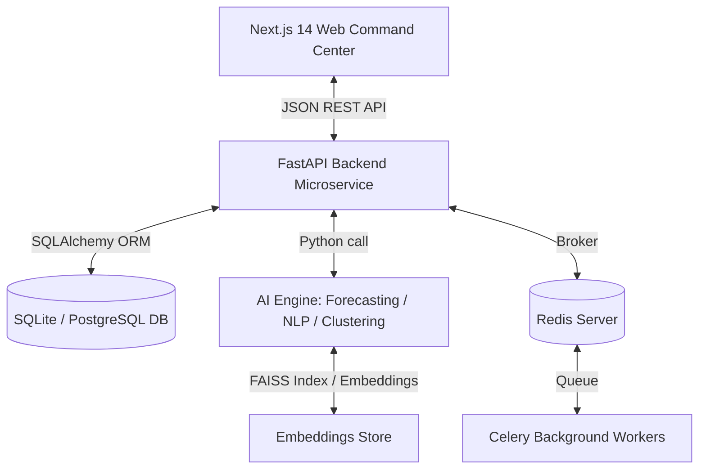

# KSP Sentinel Architecture

This document describes the structural design of the **KSP-Sentinel AI-Powered Crime Intelligence Platform**.

## System Overview

KSP-Sentinel is a multi-tier enterprise platform composed of three primary blocks:

---

## 1. Frontend Command Center (Next.js)
- **App Router**: Organized via Next.js 14 App Router, providing server-rendered pages and dynamic client interactions.
- **Tailwind CSS**: Designed with a police theme: deep charcoal backgrounds, neon alerts, glassmorphism overlays, and strict typography.
- **Charts (Recharts)**: High performance vector charts demonstrating monthly trends and forecasted crime categories.
- **Maps (Leaflet.js)**: Displays local coordinates, heatmaps, and coordinates for patrol paths.
- **Interactivity**: Dynamic filtering by Year, District, Category, and Police Station.

## 2. API Microservice (FastAPI)
- **Asynchronous Execution**: Leveraging ASGI for parallel processing and speedy API serving.
- **Modular Routing**: Separated into auth, dashboard, crimes, districts, forecast, network, chatbot, and export controllers.
- **Database Engine**: SQLAlchemy provides support for PostgreSQL, with fallback support for SQLite.

## 3. Predictive AI Engine (Python Modules)
- **Embedding Search**: Uses Sentence-Transformers to encode complaints, mapping similar cases via FAISS or NumPy cosine similarity.
- **Clustering (DBSCAN / KMeans)**: Converts latitude/longitude coordinates into crime density clusters.
- **Forecasting (ARIMA / Prophet / LSTM)**: Processes historical monthly crime counts to predict occurrences for the upcoming quarter.
- **Network Analysis (NetworkX)**: Evaluates centralities and maps community relationships for accused, victims, stations, and crime types.
